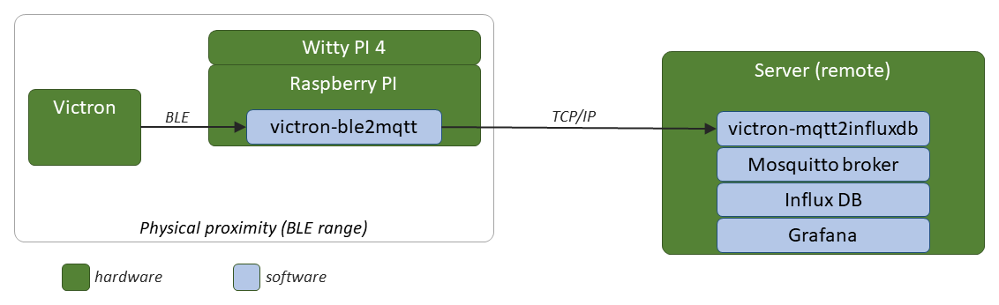
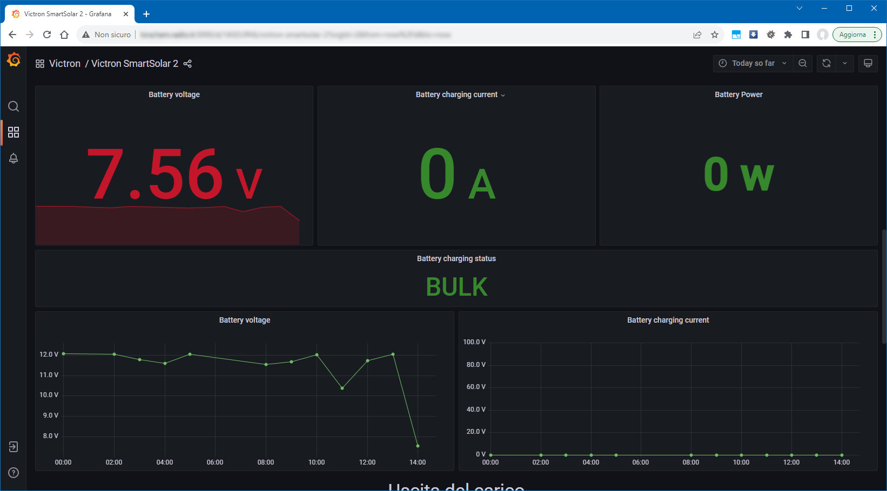
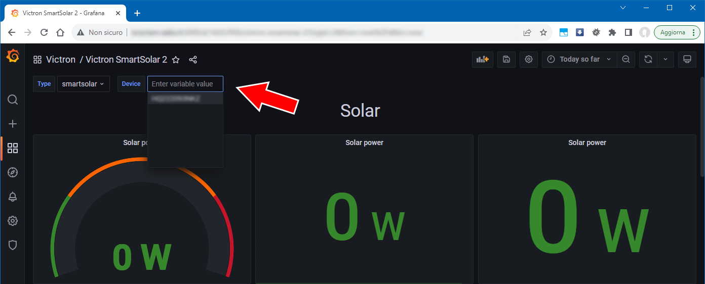

<h1 style="text-align: center;">Victron BLE Monitor</h1>
<br>
    
***Victron BLE monitor*** is a software stack that allow to save and monitor the status of Victron devices.  
The two main softwares (*`Victron BLE 2 MQTT`* and *`Victron MQTT 2 InfluxDB`*) are forks and mix of different projects (references below).

The system requires a linux based computer (Raspberry PI or similiar) placed in the proximity of the Victron device.  
The Raspberry PI periodically reads data from Victron (via BLE) and send it to a InfluxDB database (via MQTT).  
The data can be then viewed on a Grafana dashboard.

***Note:*** this has only been tested with Victron solar via BLE on a Raspberry PI 3 or 4B

***Disclaimer:*** I am in no way affiliated with any of the hardware or software we used


### Important
***This is an empty container with NO source code.***  
The only purpose of this project is:
- to describe the overall architecture of the system
- to describe the software involved (subprojects and external) and how they are used in the stack
- to provide a link to the actual software


## Index

- [Architecture](#architecture)
- [Hardware components](#hardware-components)
- [Software components](#software-components)

## <a id="architecture"></a>Architecture
The following diagram shows the overall architecture of the system, including all hardware and software components used:  




More information about the software can be found in section [Software components](#software-components).

<br>

## <a id="hardware-components"></a>Hardware components

- [Raspberry PI](#raspberry-pi)
- [Witty PI 4 (optional)](#witty-pi)
- [Smart Plug (optional)](#smart-plug)
- [Data Server](#data-server)

### <a id="raspberry-pi"></a>Raspberry PI

The system uses a Raspberry PI that has to be placed in the proximity of the Victron device to communicate with it via Bluetooth or Bluetooth Low Energy (BLE).  
We used Raspberry PI 3 and 4, as they already integrated Bluetooth hardware, but teorethically any mini PC or Single Board Computer running Linux should work.  

<br>

The Raspberry PI only executes one software: `Victron BLE 2 MQTT`  

This software connect to the Victron device via Bluetooth, retrieve the status, format the data in a JSON message and send it to a remote MQTT broker.  
More detail about this software can be found in [victron-ble2mqtt](#victron-ble2mqtt) chapter, or in its repository: [victron-ble2mqtt](https://github.com/politi/victron-ble2mqtt)

<br>

### <a id="witty-pi"></a>Witty PI (optional)
The Raspberry PI have a very low power consumption (compared to a standard PC) but since we used it to monitor a Victron Solar device, attached to a solar panel + battery, we wanted to reduce it to the minimum to avoid "wasting" battery power for the raspberry.  
Besides, the operation of reading data from Victron via BLE and sending it to the database (via MQTT) only takes a few seconds, so it's not really not necessary to keep the PI powered up 24/7.  
Ideally we could use a microcontroller (Arduino, ESP32, etc..), but the lack of dedicated software librares for reading data from Victron via BLE lead us to a "standard" Linux based solution.  

To significantly reduce energy usage, we attached a Witty PI 4 board on top of the Raspberry PI. This allows to schedule a power ON and OFF sequence during the day.  

Witty PI allows to define the sequence of power ON and OFF using simple text based scripts.  
Please take a look at the [Witty PI 4 User Manual](https://www.uugear.com/doc/WittyPi4_UserManual.pdf) for more details on how it works and on the script syntax.

There is also a web page where you can easily generate your sequence, simulate it, and export the script.  
You can find it here: [Witty Pi Schedule Script Generator](http://www.uugear.com/app/wittypi-scriptgen/)

<br>

Since the read-send operation only taked a few seconds, we scheduled a "duty cycle" of 2 minutes ON and 18 minutes OFF, for a 20 minutes interval between every measure.  
So, every 20 minutes the Raspberry PI powers ON, reads data from Victron, send it to the server, and shuts down.  

To be able to access the Raspberry for maintenance (i.e. software updates), we also scheduled a 1-hour ON window at 20:00 (8 PM) every day.

Please visit the [Witty PI 4 Home Page](https://www.uugear.com/product/witty-pi-4/) for detailed information about features, pricing and usage.

Any other similiar solution should work, but it's only needed if you have power constraints.

  
<br>

### <a id="smart-plug"></a>Smart Plug (optional)
If your Victron and Raspberry devices are located near a WiFi, you can use a smart plug to gain control of the Raspberry at any time.

1) Connect the Raspberry power supply to the smart plug
2) Configure the smart plug to connect to the WiFi
3) Configure the Witty PI 4 to power ON the Raspberry after power loss

<br>

***Note:*** You have to take into account the power ON/OFF sequence to be sure you have enough time to operate before the next scheduled power OFF is triggered.

<br>

Now, if you need to access the Raspberry from remote (i.e. for maintenance, backup, software updates, ecc) you can, in any moment (and if the Raspberry is not already ON):
- Turn OFF the smart plug (using its mobile app). This will remove power from the WittyPI/RaspberryPI
- Wait a few seconds
- Turn back ON the smart plug
- The Witty PI will automaticallty power ON the Raspberry PI.  
<br>

***Note:*** Before switching off the smart plug, please be sure that the Raspberry is already in power off state. Switching off smart plug will immediately remove power from the Raspberry PI (that is, without sending it the proper shutdown signal).   
If the Raspberry PI is turned on and it is writing some data to its storage, a power interruption can lead to <u>data loss</u> or even <u>file system corruption</u>.

<br> 

In order for this "solution" to work, you first need to configure Witty PI to automatically turn on the Raspberry after power loss (it's a one time operation). 
- log in to the Raspberry via SSH
- go to the directory where you installed WittyPI software: `cd WittyPI`
- launch the script `./wittyPi.sh` 
- select `View/change other settings...`
- select `Default state when powered`
- set it to `ON`

Please take a look at the official Witty PI documentation for more information.

<br>

### <a id="data-server"></a>Data Server
The data retrieved from Victron is sent to a remote server that stores all measures to a database.  
The data server also hosts a dashboarding system for user monitoring.

If your Raspberry will always be powered on and it has a public IP address, you could install all the server software components directly on the PI and access the data and dashboard directpy from the PI.  
This could work if you only have to monitor a single Victron device, but for performances and reliability (especially is data will be stored on SD card) the Raspberry PI not ideal as server.  
For production environment, especially when you have several Victron devices to monitor, it's much better to use a dedicated and centralized data server.  
Besides, since we decided to schedule power ON and OFF of the Raspberry PI to save power (using Witty PI), it was not possible to install all the "server side" software stack directly on the Raspberry.  


The data server hosts several softwares:

- `Mosquitto`: an MQTT broker to receive data from Victron
- `Influx DB`: a time series database to store all measures
- `Grafana`: a dashboarding system to allow users to monitor the status of Victron devices
- `Victron MQTT 2 InfluxDB`: a software specifically developed to retrieve data coming from victron device and store it to Influx (via MQTT).

Details on every software can be found in the next sections


## <a id="software-components"></a>Software components

1) [Victron BLE 2 MQTT](#victron-ble2mqtt)
2) [Victron MQTT 2 InfluxDB](#victron-mqtt2influxdb)
3) [Mosquitto MQTT broker](#mosquitto-broker)
4) [InfluxDB](#influxdb)
5) [Grafana](#grafana)

 

### <a id="victron-ble2mqtt"></a>Victron BLE 2 MQTT
This software runs on the Raspberry PI (or other PC/SBC): it reads the data/status from Victron device, format the data in a JSON message and send it to a MQTT broker.

This software is a fork of [victron](https://github.com/FloMaetschke/victron) developed by [FloMaetschke](https://github.com/FloMaetschke)  
But has been modified to use [victron_ble](https://github.com/keshavdv/victron-ble), a python library developed by [keshavdv](https://github.com/keshavdv) to parse Instant Readout advertisement data from Victron devices.

I use this repository remotely monitor Victron devices installed on the field, by sending the parsed data to an MQTT broker.  

More detail about this software, and the source code, can be found in its GitHub repository: [victron-ble2mqtt](https://github.com/politi/victron-ble2mqtt)

***Note:*** this software has only been tested with Bluetooth communication. Serial communication has not been tested (yet).


***<u>Installation</u>***  
- Install Python and PIP
```bash
sudo apt update
sudo apt install python3.8
sudo apt install python3-pip
```
- Clone this repo
- install dependencies
```bash
pip install -r requirements.txt
```
- on raspberry pi os, the following libs are also required:
```bash
sudo apt install build-essential libdbus-glib-1-dev libgirepository1.0-dev libcairo2 libcairo2-dev
```
- copy files to `/opt` or other choosen directory
```bash
cd /opt
unzip victron-ble2mqtt.zip
```

***<u>Configuration</u>***  

To configure the software, you need to edit the config.yml file found in the same directory of the script, to match the parameters of both the Victron device and the MQTT broker.

```yaml
## Add your devices here:
#devices:
#    - name: Shunt1
#      type: smartshunt
#      protocol: bluetooth-ble
#      mac: fd:d4:50:0f:6c:1b
#    - name: Solar1
#      type: smartsolar
#      protocol: bluetooth
#      mac: F9:8E:1C:EC:9C:72
#    - name: Phoenix1
#      type: pheonix
#      protocol: serial
#      port: /dev/ttyUSB0
devices:
    - name: HQ123456NKZ
      type: smartsolar
      protocol: bluetooth
      mac: FA:AC:27:84:C6:6F
      encryptionKey: 28a2158cf5b76f78b539e4140567b36f


## MQTT server
## Mandatory:
##   host: IP or Hostname
##   port: 1883
##   base_topic: victron
## Optional:
##   username: MQTT_USER
##   password: PASSWORD
mqtt:
    #host: 127.0.0.1
    host: mydataserverip.com
    port: 1883
    base_topic: victron
    hass: False
    #username: USERNAME
    #password: PASSWORD
```

***Note***: the MQTT configuration should match the one set in the [Mosquitto MQTT Broker](#mosquitto-broker) on data server.


***<u>Command line arguments</u>***
```
./victron.py -h
usage: victron.py [-h] [--debug] [--quiet] [-c] [-C CONFIG_FILE] [-v] [-d NUM / NAME]

Victron Reader (Bluetooth, BLE and Serial) 

Current supported devices:
  Full: 
    - Smart Shunt (Bluetooth BLE)
    - Phoenix Inverter (Serial)
    - Smart Shunt (Serial)
    - Smart Solar (Serial)
    - Blue Solar (Serial)
  Partial: 
    - Smart Shunt (Bluetooth)
    - Smart Solar (Bluetooth)
    - Orion Smart (Bluetooth)
Default behavior:
  1. It will connect to given device
  2. Collect and log data summary as defined at the config file
  3. Disconnect and exit

options:
  -h, --help            show this help message and exit

  --debug               Set log level to debug
  --quiet               Set log level to error

  -C CONFIG_FILE, --config-file CONFIG_FILE
                        Specify different config file [Default: config.yml]
  -v, --version         Show version and exit

  -d NUM / NAME, --device NUM / NAME [MANDATORY]

```


***<u>Execution</u>***
Start the script for your desired device: `python3 victron.py -d 0`
Add any other command line parameters as needed


***<u>Install as startup service</u>***  
To install as a service using systemd, follow this procedure

```bash
sudo ln -s /opt/victron-ble2mqtt/victron-ble2mqtt.service /etc/systemd/system/victron-ble2mqtt.service

sudo systemctl enable victronMonitor.service

sudo systemctl start victronMonitor.service
```

***Note:*** keep in mind that the source code is set to only get read data once, sent it do MQTT, and exit. If you need to read data more than once, you have to either change the code or run it multiple times (i.e. using crontab)

***<u>Install in crontab</u>***  
Depending on you needs you can also (alternatively) configure it running at boot or periodically using cron.
`crontab -e`

Add/uncomment the following lines in the crontab 

```crontab
#*/5 * * * * /opt/victron-ble2mqtt/victron-ble2mqtt.sh  # Run every 5 minutes

# run at boot with a 10 second delay (Witty Pi is used to power OFF/ON periodically to reduce power consumption)
#@reboot sleep 10 && /opt/victron-ble2mqtt/victron-ble2mqtt.sh
```


### BLE pairing
If you are using bluetooth or bluetooth ble you must be pairing your devices via `bluetoothctl`.

```bash
# Open bluetoothctl from commandline
bluetoothctl

# Enable scanning
scan on
  
# Get the mac address of your device
# pair device and enter pin
pair MAC
```

### Fetching Device Encryption Keys
To be able to decrypt the contents of the advertisement, you'll need to first fetch the per-device encryption key from the official Victron application. The method to do this will vary per platform.
 
**OSX**

1. Install the Victron app from the Mac App Store
2. Pair with your device at least once to transfer keys
3. Run the following from Terminal to dump the known keys (install `sqlite3` via Homebrew)
```bash
sqlite3 ~/Library/Containers/com.victronenergy.victronconnect.mac/Data/Library/Application\ Support/Victron\ Energy/Victron\ Connect/d25b6546b47ebb21a04ff86a2c4fbb76.sqlite 'select address,advertisementKey from advertisementKeys inner join macAddresses on advertisementKeys.macAddress == macAddresses.macAddress'
```

**Linux**

1. Download the Victron AppImage app from the Victron website.
2. Pair with your device at least once to transfer keys
3. Run the following from a terminal to dump the known keys (install `sqlite3` via your package manager)
```bash
sqlite3 ~/.local/share/Victron\ Energy/Victron\ Connect/d25b6546b47ebb21a04ff86a2c4fbb76.sqlite 'select address,advertisementKey from advertisementKeys inner join macAddresses on advertisementKeys.macAddress == macAddresses.macAddress'
```

**Windows**

1. Download the VictronConnect installer from the Victron website and install.
2. Pair with your device at least once to transfer keys
3. Open Explorer, navigate to ```%AppData%\Local\Victron Energy\Victron Connect\```
4. Open [SQLite Viewer](https://inloop.github.io/sqlite-viewer/) in a web browser of your choice
5. Drag and drop the ```d25b6546b47ebb21a04ff86a2c4fbb76.sqlite``` file from Explorer into the SQLite Viewer window

<br>

### WittyPI4 scripts


For our needs we generated a schedule script with the following characteristics:
- start at 00:00
- 2 minutes ON
- 18 minutes OFF (20 miutes cycle)
- repeat the pattern for 60 times (until 20:00)
- 58 minutes ON
- 2 minutes OFF
- 2 minutes ON
- 18 minutes OFF
- repeat the last ON/OFF pattern for 9 times (up to 23:59)

This is an extract of the generated script
```bash
BEGIN 2023-08-01 00:00:00
END   2043-12-31 23:45:00
ON    M2
OFF   M18
ON    M2
OFF   M18
... # last two lines repeated 58 more times
ON    M58
OFF   M2
ON    M2
OFF   M18
ON    M2
OFF   M18
... # last two lines repeated 6 more times
```

The complete script is stored in file `/opt/wittypi/wittipy/schedules/victron-monitor.wpi`
If you need to create a new script, you must place it in the directory where you installed the WittyPi software, inside the subdirectory `schedules`

To select the script, follow this instructions:


- log in to the Raspberry via SSH
- go to the directory where you installed WittyPI software: `cd ~/wittypi/wittypi
- launch the script `./wittyPi.sh`
- choose: `6. Choose schedule script`
- select the script you want to use (i.e. `[8] victron-monitor.wpi`)
- select `13. Exit`

To temporarly disable ON/OFF schedules, select the script called `turn_on_every_hour.wpi`.  
This script attempt to keep the Raspberry PI always on, by sending a power-on signal every hour (if the Raspberry PI is already ON, this command has no effect).

<br>


### <a id="victron-mqtt2influxdb"></a>Victron MQTT 2 InfluxDB 

This software implements an MQTT to InfluxDB Bridge.
It receives messages from victron devices sent over MQTT by [victron-ble2mqtt](#victron-ble2mqtt) and store them to InfluxDB.

This is a fork of [MQTT-to-influxdb.py](https://gist.github.com/zufardhiyaulhaq/fe322f61b3012114379235341b935539) script, developed by [zufardhiyaulhaq](https://gist.github.com/zufardhiyaulhaq), so most of the credits goes to him.  
The script has been slightly modified to my specific needs (mainly I changed the message parsing and added a configuration file).

More detail about this software, and the source code, can be found in its GitHub repository: [victron-mqtt2influxdb](https://github.com/politi/victron-mqtt2influxdb)

***<u>Installation</u>***  

- Install Python and PIP
```bash
sudo apt update
sudo apt install python3.8
sudo apt install python3-pip
```
- Clone the repo
- install dependencies
```bash
pip install -r requirements.txt
```
- copy files to `/opt` or other choosen directory
```bash
cd /opt
unzip victron-mqtt2influxdb.zip
cd victron-mqtt2influxdb
chmod +x victron-mqtt2influxdb.py
```

***<u>Configuration</u>***

To configure the software, you need to edit the config.yml file found in the same directory of the script., to match the connection parameters of MQTT broker and InfluxDB instance


```yaml
influxdb:
    address: 127.0.0.1
    port: 8086
    database: victron
    username:
    password:


## MQTT server
##   host: IP or Hostname
##   port: 1883
##   topic: victron
##   username: MQTT_USER  --> leave blank if empty. Do Not comment
##   password: PASSWORD   --> leave blank if empty. Do Not comment
mqtt:
    address: 127.0.0.1
    port: 1883
    topic: victron/+/+    # --> # victron/[DEVICETYPE]/[DEVICENAME]  --> victron/smartsolar/HQ123456ABC
    username:
    password:
```

***<u>Manual execution</u>***  

To manually execute the software (to check if everything is working correctly):
```bash
cd /opt/victron-mqtt2influxdb
./victron-mqtt2influxdb.py
```

To interrupt the executionm, just press `Ctrl+C`

<br>

***<u>Configure as service</u>***  

For production you want the program to be automatically executed at startup as a service

```bash
 sudo ln -s /opt/victron-mqtt2influxdb/victron-mqtt2influxdb.service /etc/systemd/system/victron-mqtt2influxdb.service

 systemctl enable victron-mqtt2influxdb.service

 sudo systemctl enable victron-mqtt2influxdb.service

 sudo systemctl start victron-mqtt2influxdb.service

 systemctl status victron-mqtt2influxdb.service
```

<br>

### <a id="mosquitto-broker"></a>Mosquitto MQTT Broker
This is required to receive data coming from Raspberry PI.  
Please follow official instruction for installation and configuration  
[Eclipse Mosquitto Home Page](https://mosquitto.org/)


***Note:*** remember that you need to configure the [Victron BLE 2 MQTT](#victron-ble2mqtt) service on Raspberry PI to connect it to this broker

<br>

### <a id="influxdb"></a>InfluxDB

This is required to receivestore data coming from Victron devices.  
Please follow official instruction for installation and configuration  
[InfluxDB Home Page](https://www.influxdata.com/influxdb/)

When InfluxDB is installed and configured, you need to create the database where data will be stores.
The name of the database has to match what has been configured in the `config.yml` file of the [victron-mqtt2influxdb](#victron-mqtt2influxdb)

to create the database you can use the influxdb console
```bash
influx
> create database victron
> exit
```
No other configuration is needed for Influx DB.

<br>

### <a id="grafana"></a>Grafana 
Grafana is an open source web application for interactive data visualization: [Grafana Home Page](https://www.grafana.com).  
It alows you to create custom dashboards to visualize data coming from various sources such as InfluxDB or other databases.


***<u>Configuration</u>***  
Please follow official instruction for installation and configuration  
[Grafana official documentation](https://grafana.com/docs/grafana/latest/)

***<u>Dashboard</u>***  
We created a Grafana dashboard that shows operational parameters and data history (table and charts) in the specified time interval



<br>

On the top part of the screen you can choose the Victron device that you want to show the data of.   



When a new Raspberry is "connected" (via BLE) to a new Victron device, the new device is automatically added to the menu.


***<u>Import Dashboard</u>***  
If you want to import the dashboard we created, please download it from here: ***[Victron dashboard](victron-dashboard.json)***    
**TODO: Replace with Github link**.  

And follow the instructions found here: [Import dashboard](https://grafana.com/docs/grafana/latest/dashboards/manage-dashboards/#import-a-dashboard)

